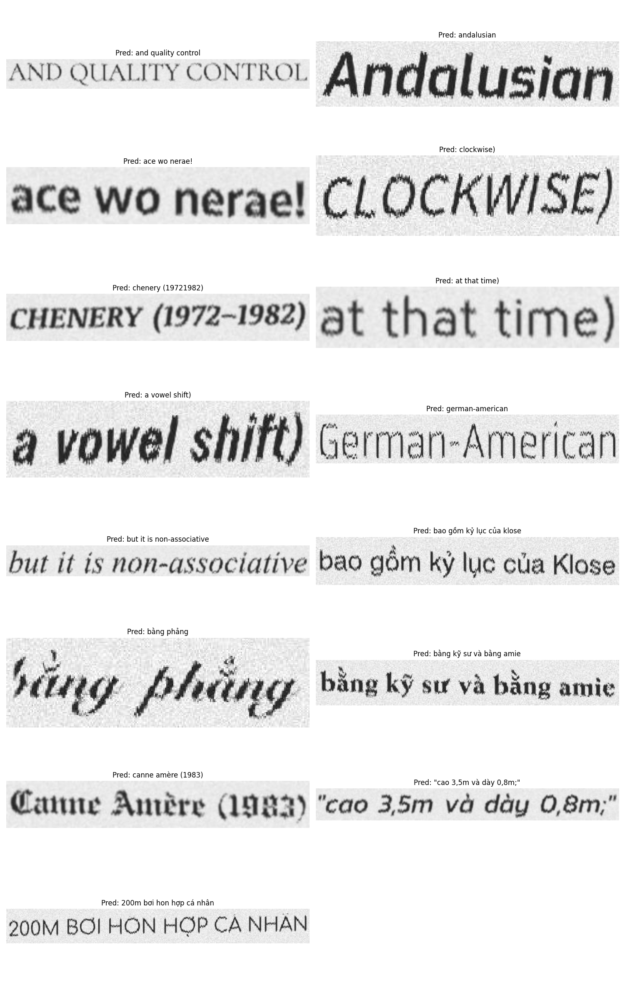

# OCR Project with CRNN (EfficientNet-B5 + BiLSTM)

This project implements an Optical Character Recognition (OCR) system using a CRNN (Convolutional Recurrent Neural Network) architecture.

## Model Architecture

The model combines a CNN backbone with a recurrent sequence model and CTC loss for sequence recognition.

- **Feature Extractor**: EfficientNet-B5 (pretrained on ImageNet)
- **Sequence Modeling**: Bidirectional LSTM (2 layers, hidden size 256)
- **Decoding**: CTC Decoder with Beam Search

## Project Structure

- `model.py`: Definition of the CRNN model  
- `train.py`: Training script  
- `dataset.py`: Custom Dataset class and data transformations  
- `config.py`: Configuration parameters (paths, hyperparameters)  
- `utils.py`: Utility functions (CTC Beam Search Decoder)  
- `infer_random.py`: Run inference on random test images and visualize results  
- `predict.py`: Run inference on a folder of images and save results to JSON  


## Installation

1. Clone the repository.
2. Install dependencies:

```bash
pip install -r requirements.txt

